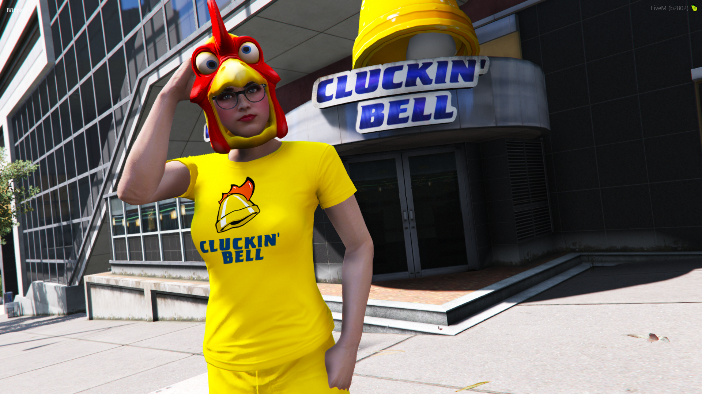

<h1 align="center">Tay's Cluckin Bell Uniform Pack 👕</h1>

<h2 align="center">Authentic High Quality Cluckin' Bell Uniforms For AltV, FiveM &amp; Single Player</h2>

  
  
  

-------------------------------------------------

Introducing the all-new Cluckin' Bell uniform!

Are you tired of serving burgers in clothes that don't do you justice? Say goodbye to those other fast food joints with their low-quality, knockoff uniforms and their outrageously priced, copycat clothing.

Cluckin' Bell has got you covered with our top-of-the-line uniforms that are sure to make you stand out from the crowd. Our hats, shirts, and pants are made from only the finest materials, designed to keep you comfortable and looking great while you serve up our signature chicken dishes.

Why settle for less when you can have the real deal? Don't be caught dead in a low-quality Chinatown knockoff from the tebex store. And don't even think about wearing those boring, generic uniforms from other fast food joints.

When you wear a Cluckin' Bell uniform, you're not just serving up food, you're making a statement. You're saying that you have taste, that you have style, and that you demand the best.

So what are you waiting for? Order your Cluckin' Bell uniform today and start serving up our delicious chicken in style. Don't settle for imitation, choose the real deal. Choose Cluckin' Bell and taste the cock!

--------------------------------

# Screenshots 📸

| | | |
|-|-|-|
|  |  |  |
|   |  |  |
|                                                |   |                                              |
--------------------------------

# Content:

1x Male shirt
1x Male cap (front facing)
1x Male cap (backwards facing)

1x Female shirt
1x Female cap (front facing)
1x Female cap (backwards facing)

--------------------------------------

# INSTALLATION INSTRUCTIONS:

# Single Player

- Copy the tayscluckinbell folder found within the FILES > SINGLE PLAYER folder with the dlc.rpf file to this sub folder of your mods folder: mods/update/x64/dlcpacks (Create it if its not there)

- In order to make the game load this new dlc.rpf file, we need to modify the games dlclist.xml, this can be done by searching for dlclist.xml using OpenIV and copying it to your mods folder: mods/update/update.rpf/common/data (Create it if its not there)

- Open the dlclist.xml and add the following:

dlcpacks:/tayscluckinbell/

To apply the new clothes you will need some mod menu, suggested ones are:
Menyoo: https://github.com/MAFINS/MenyooSP/releases(https://gta5-mods.com/scripts/menyoo-pc-sp)

--------------------------------------

# ALTV

Open the FILES folder, go to ALTV and add tayscluckinbell to your server.cfg as a separate line below resources and before the enclosing. Your server.cfg resources configuration could look similar to this:

resources:
altv-better-clothing,
tayscluckinbell

Start your server and connect to it

--------------------------------------

# FiveM

- Download vMenu and put it in your server/resources folder vMenu( https://github.com/TomGrobbe/vMenu/releases)

- Open the FILES folder and drag the tayscluckinbell inside the FIVEM folder, into your FiveM resources

- Add ensure tayscluckinbell to your server.cfg

- Press M to open vMenu and browse thru your new added clothes (They are always added to the end / last DLC clothes)

IF THEY DO NOT APPEAR, YOU DO NOT HAVE THE REQUIRED PATREON SUBSCRIPTION TO STREAM CLOTHING.
